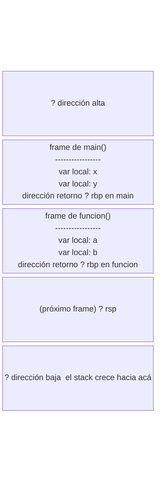
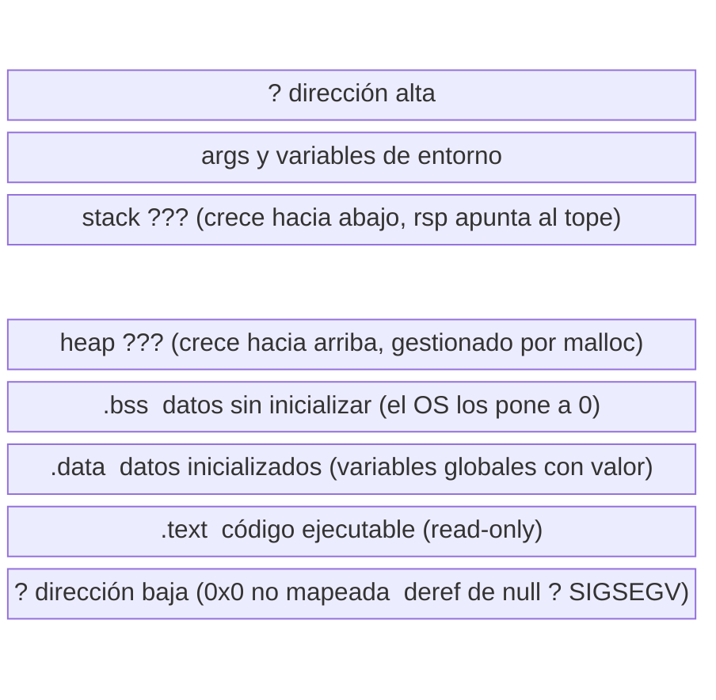

# Una intuición de máquina

La mayoría de los programadores trabaja con una abstracción: las variables existen, los enteros son enteros, la memoria es un espacio infinito. Esa abstracción es útil y está bien construida. Pero en sistemas, la abstracción se rompe con frecuencia: los enteros tienen overflow, la memoria tiene límites, y las variables en realidad son ubicaciones en registros o en el stack.

Esta sección construye una intuición concreta de cómo la máquina ve tu programa. No es un curso completo de arquitectura: es el mínimo para que las herramientas del laboratorio tengan sentido.

## Los enteros no son infinitos: complemento a dos

En C, `int` es un entero de 32 bits en complemento a dos. Eso tiene una consecuencia inmediata:

```c
#include <stdio.h>
#include <limits.h>

int main(void) {
    int maximo = INT_MAX;          // 2147483647
    printf("%d\n", maximo);
    printf("%d\n", maximo + 1);    // -2147483648 — overflow silencioso
    return 0;
}
```

El resultado es `-2147483648`. No es un bug del compilador. Es el comportamiento definido de los enteros de 32 bits en complemento a dos.

### Cómo funciona el complemento a dos

Con `n` bits podés representar $2^n$ valores. Para 32 bits: $2^{32} = 4294967296$ valores posibles.

La mitad son positivos (incluyendo el cero), la otra mitad son negativos:
- Positivos: $0$ a $2^{31} - 1 = 2147483647$
- Negativos: $-2^{31} = -2147483648$ a $-1$

El truco del complemento a dos es que la suma funciona igual para positivos y negativos sin hardware especial. Para negar un número: invertí todos los bits y sumá 1.

```
  5 en 8 bits:  00000101
 -5 en 8 bits:  11111011  (invertir bits: 11111010, sumar 1: 11111011)

  5 + (-5):
  00000101
+ 11111011
----------
 100000000  ? el bit 9 se desborda y se descarta ? 0x00 = 0 ?
```

¿Por qué importa esto? Porque cuando veas `0xffffffff` en `gdb`, sabés que puede ser `-1` como `int` o `4294967295` como `unsigned int`. Son los mismos bits; la interpretación depende del tipo. Esto también es la razón por la que comparar un `int` con un `unsigned int` produce resultados inesperados en C: el compilador hace conversiones implícitas que cambian el valor.

### El comportamiento indefinido de overflow

En C, el overflow de enteros **con signo** (`int`, `long`) es **comportamiento indefinido (UB)**. No está garantizado que produzca `-2147483648`: el compilador puede asumir que ese overflow nunca ocurre y eliminar código de comprobación.

```c
// Esto puede ser optimizado agresivamente por el compilador
if (x + 1 > x) {  // siempre verdadero si el compilador asume no-overflow
    ...
}
```

El UB en C es un tema con mucha profundidad: el estándar deja varios comportamientos sin definir para permitir optimizaciones. En L1b vas a estudiar esto sistemáticamente con ejemplos concretos de cómo los compiladores lo explotan. Por ahora alcanza con saber que existe y que `-fsanitize=undefined` lo detecta en runtime.

## Registros: las variables de la CPU

La CPU no trabaja con variables. Trabaja con **registros**: ubicaciones de almacenamiento dentro del procesador, extremadamente rápidas y en número fijo.

En x86-64 los registros de uso general son: `rax`, `rbx`, `rcx`, `rdx`, `rsi`, `rdi`, `r8`–`r15`. Cada uno almacena 64 bits. Los compiladores "mapean" tus variables C a registros siempre que pueden, porque los registros son mucho más rápidos que la RAM.

Algunos registros tienen roles especiales definidos por la **convención de llamado** (ABI de x86-64 en Linux):

| Registro | Rol |
|---|---|
| `rdi`, `rsi`, `rdx`, `rcx`, `r8`, `r9` | Primeros 6 argumentos de una función |
| `rax` | Valor de retorno de la función |
| `rsp` | Stack pointer — apunta al tope actual del stack |
| `rbp` | Base pointer — apunta al inicio del frame actual |
| `rip` | Instruction pointer — dirección de la próxima instrucción |

El compilador decide qué variable va a qué registro. Con `-O0` la asignación es directa y predecible; con `-O2` el compilador reordena, fusiona y elimina variables según le conviene.

> **Profundidad de ABI**: la convención de llamado completa de x86-64 (qué registros preservar al llamar una función, cómo pasar structs, el prologue/epilogue del stack frame) se cubre en L1b. Ahí vas a leer assembly real con propósito, entender exactamente qué hace el compilador y por qué. Por ahora alcanza con saber que `rdi` es el primer argumento y `rax` es el retorno.

## El stack: memoria de las llamadas a funciones

El **stack** es una región de memoria que crece hacia abajo. Cada llamada a función reserva un **frame**: espacio para las variables locales, los argumentos que no caben en registros y la dirección de retorno.



`push rbp` / `mov rbp, rsp` al principio de una función y `pop rbp` / `ret` al final mantienen esa cadena. Es lo que `gdb` te muestra cuando hacés `backtrace`: la cadena de frames desde el punto de parada hasta `main`.

El stack tiene un tamaño límite (típicamente 8 MB en Linux). Si creás arrays muy grandes como variables locales o hacés recursión muy profunda, podés desbordarlo: el OS señaliza al proceso con un segfault. Este límite es configurable con `ulimit -s`, pero no se puede hacer infinito.

### Stack vs heap

Las variables locales viven en el stack. La memoria reservada con `malloc` vive en el **heap** — una región separada que crece hacia arriba.

```c
int arr_stack[1000];          // en el stack, se libera automáticamente al salir de la función
int *arr_heap = malloc(4000); // en el heap, se libera cuando vos llamás free()
```

El heap no tiene el límite de 8 MB del stack (está limitado por la RAM física y virtual disponible), pero su gestión es manual y propensa a errores. En L2 vas a estudiar cómo funciona `malloc` internamente, los patrones de uso correcto, los errores más comunes y las herramientas para detectarlos. Por ahora alcanza con saber la diferencia.

## Leer ensamblador: la primera vez

No necesitás escribir ensamblador ahora. Sí necesitás poder leerlo sin entrar en pánico.

```c
// suma.c
int suma(int a, int b) {
    return a + b;
}
```

```bash
gcc -O0 -S suma.c -o suma.s
cat suma.s
```

El resultado en x86-64 será algo así:

```asm
suma:
    push   rbp                          ; guardar el frame pointer del llamador
    mov    rbp, rsp                     ; el nuevo frame empieza acá
    mov    DWORD PTR [rbp-4], edi       ; guardar parámetro 'a' en el stack
    mov    DWORD PTR [rbp-8], esi       ; guardar parámetro 'b' en el stack
    mov    edx, DWORD PTR [rbp-4]       ; cargar 'a' en edx
    mov    eax, DWORD PTR [rbp-8]       ; cargar 'b' en eax
    add    eax, edx                     ; eax = eax + edx (resultado)
    pop    rbp                          ; restaurar frame pointer
    ret                                 ; retornar (valor de retorno en rax)
```

`edi` y `esi` son las mitades inferiores de `rdi` y `rsi`. Como los argumentos son `int` (32 bits), el compilador usa los registros de 32 bits.

Con `-O2`, la misma función queda:

```asm
suma:
    lea    eax, [rdi+rsi]   ; eax = rdi + rsi directamente, una instrucción
    ret
```

Todo el manejo de stack desaparece. El compilador ve que puede sumar los argumentos directamente y retornar. Mismo resultado, código completamente distinto. No hay frame, no hay backup de registros, no hay variables locales.

> En L1b vas a leer y escribir ensamblador x86-64 con propósito: entender la ABI, analizar lo que hace el compilador con código real, y debuggear a nivel de instrucción. Por ahora, la habilidad que necesitás es reconocer `call`, `ret`, `push`, `mov` y entender que hay código de máquina detrás de cada función C.

## call y ret: lo que realmente pasa al llamar una función

Cuando el programa ejecuta `call suma`, no "entra" mágicamente en otra función. Lo que pasa:

1. El CPU pushea la dirección de la siguiente instrucción (la dirección de retorno) al stack.
2. El CPU salta a la dirección de `suma`.
3. `suma` hace su trabajo.
4. `ret` saca la dirección del stack y salta a ella.

Una función es, a nivel de máquina, una **dirección**. `call printf` es un salto a la dirección donde está el código de `printf`. El valor de retorno siempre va en `rax`. No hay magia: es mecánica.

## Ver el ensamblador de un binario ya compilado

Si no tenés el fuente, o si querés ver el ensamblador con optimizaciones de un binario existente:

```bash
objdump -d ./hello | head -60
```

`objdump -d` desensambla el ejecutable. Con símbolos de debug (`-g`), los nombres de funciones y las líneas de fuente aparecen en comentarios. Sin `-g`, solo ves las direcciones y las instrucciones.

## Las regiones de memoria de un proceso

Un proceso tiene su espacio de direcciones virtuales dividido en regiones:



`.text`, `.data`, `.bss` son secciones del ELF. El kernel las mapea en memoria al ejecutar el proceso. Esto es solo la vista de alto nivel: la historia completa incluye páginas, tablas de página, espacio de usuario vs kernel, y memoria mapeada de bibliotecas dinámicas. Eso es L7.

### Ver el layout real con /proc

El diagrama anterior no es teórico — podés verlo en vivo para cualquier proceso en ejecución:

```c
// maps_demo.c — imprime su propio mapa de memoria
#include <stdio.h>

int global_init   = 42;       // .data
int global_uninit;            // .bss

int main(void) {
    int local = 99;           // stack
    printf("code:          %p\n", (void*)main);
    printf("global (init): %p\n", (void*)&global_init);
    printf("global (bss):  %p\n", (void*)&global_uninit);
    printf("local (stack): %p\n", (void*)&local);

    // leer /proc/self/maps para ver el layout completo
    FILE *maps = fopen("/proc/self/maps", "r");
    char line[256];
    while (fgets(line, sizeof(line), maps)) fputs(line, stdout);
    fclose(maps);
    return 0;
}
```

```bash
gcc -g -O0 maps_demo.c -o maps_demo && ./maps_demo
```

La salida de `/proc/self/maps` tiene el formato:

```
55a3b1234000-55a3b1235000 r--p 00000000 08:01 ... maps_demo      ? .text (lectura, no escritura)
55a3b1235000-55a3b1236000 rw-p 00001000 08:01 ... maps_demo      ? .data/.bss
7f8c12340000-7f8c12500000 r-xp 00000000 08:01 ... libc.so.6      ? libc mapeada
7ffd8a100000-7ffd8a121000 rw-p 00000000 00:00 ... [stack]        ? stack del proceso
```

Cada línea es una región: rango de direcciones, permisos (`r`=leer, `w`=escribir, `x`=ejecutar), y nombre. El código ejecutable es `r-x` (no `rwx` — no podés escribir en él). El stack y heap son `rw-` (no ejecutables). ASLR hace que esas direcciones cambien con cada ejecución.


## La dirección de una variable y ASLR

En C, el operador `&` te da la dirección de memoria de una variable. Esa dirección es un número: la posición en el espacio de direcciones **virtuales** del proceso.

```c
int x = 42;
printf("x = %d, dirección = %p\n", x, (void*)&x);
```

Cada ejecución puede dar una dirección diferente gracias a **ASLR** (Address Space Layout Randomization): el kernel carga el stack, el heap y las bibliotecas dinámicas en posiciones aleatorias del espacio de direcciones con cada ejecución.

ASLR es una medida de seguridad: si un atacante quiere sobrescribir la dirección de retorno de una función para redirigir la ejecución, ASLR hace mucho más difícil adivinar a dónde saltar. Sin ASLR, las direcciones son siempre iguales y esa información es explotable.

En el laboratorio a veces conviene desactivar ASLR para que `gdb` sea predecible:

```bash
# Desactivar ASLR solo para una ejecución (no afecta al sistema):
setarch $(uname -m) -R ./hello

# Alternativa dentro de gdb:
(gdb) set disable-randomization on
```

> Desactivar ASLR es seguro en el laboratorio porque estás en un contenedor aislado. En producción nunca se hace.

## La intuición que necesitás

No hace falta memorizar nada de esto ahora. La intuición que buscamos es:

- Los enteros tienen tamaño y se desbordan. El overflow con signo es UB en C.
- Las variables no "existen" en hardware: son registros o posiciones en el stack o en el heap.
- El compilador con `-O0` es predecible; con `-O2` transforma el código agresivamente.
- Una función es una dirección de memoria. `call` es un salto con dirección de retorno en el stack.
- El stack es finito. El heap es gestionado manualmente.
- Las direcciones que ves son virtuales. El kernel administra la traducción a RAM física.

Con esa base, cuando `gdb` te muestre un valor como `0xfffffff6` vas a saber qué mirás. Cuando `valgrind` te diga que accediste 8 bytes después del fin de un array, vas a poder visualizar dónde estaba ese límite. Cuando el proceso reciba un `SIGSEGV`, vas a saber que algo accedió a una dirección no mapeada.

El hardware no miente. Eso es lo bueno de trabajar en este nivel.

  5 + (-5):
  00000101
+ 11111011
----------
 100000000  ? el bit 9 se desborda y se descarta ? 0x00 = 0 ?
```

¿Por qué importa esto? Porque cuando veas `0xffffffff` en `gdb`, sabés que puede ser `-1` como `int` o `4294967295` como `unsigned int`. Son los mismos bits; la interpretación depende del tipo.

## Registros: las variables de la CPU

La CPU no trabaja con variables. Trabaja con **registros**: ubicaciones de almacenamiento dentro del procesador, extremadamente rápidas y en número fijo.

En x86-64 los registros de uso general son: `rax`, `rbx`, `rcx`, `rdx`, `rsi`, `rdi`, `r8`–`r15`. Cada uno almacena 64 bits. Los compiladores "mapean" tus variables C a registros siempre que pueden, porque los registros son mucho más rápidos que la RAM.

El compilador decide qué variable va a qué registro. Con `-O0` la asignación es directa y predecible; con `-O2` el compilador reordena, fusiona y elimina variables según le conviene.

## Leer ensamblador: la primera vez

No necesitás escribir ensamblador ahora. Sí necesitás poder leerlo sin entrar en pánico.

```c
// suma.c
int suma(int a, int b) {
    return a + b;
}
```

```bash
gcc -O0 -S suma.c -o suma.s
cat suma.s
```

El resultado en x86-64 será algo así:

```asm
suma:
    push   rbp           ; guardar el frame pointer anterior
    mov    rbp, rsp      ; el nuevo frame empieza aquí
    mov    DWORD PTR [rbp-4], edi   ; guardar parámetro a en el stack
    mov    DWORD PTR [rbp-8], esi   ; guardar parámetro b en el stack
    mov    edx, DWORD PTR [rbp-4]   ; cargar a en edx
    mov    eax, DWORD PTR [rbp-8]   ; cargar b en eax
    add    eax, edx      ; eax = eax + edx (resultado)
    pop    rbp           ; restaurar frame pointer
    ret                  ; retornar (el valor está en rax/eax)
```

La convención de llamado de x86-64 en Linux dice:
- Los primeros argumentos van en `rdi`, `rsi`, `rdx`, `rcx`, `r8`, `r9`
- El valor de retorno va en `rax`

Con `-O2`, la misma función queda:

```asm
suma:
    lea    eax, [rdi+rsi]   ; eax = rdi + rsi directamente
    ret
```

Todo el manejo de stack desaparece. El compilador ve que puede sumar los argumentos directamente y retornar. Mismo resultado, código completamente distinto.

## call y ret: lo que realmente pasa al llamar una función

Cuando el programa ejecuta `call suma`, no "entra" mágicamente en otra función. Lo que pasa:

1. El CPU pushea la dirección de la siguiente instrucción (la dirección de retorno) al stack.
2. El CPU salta a la dirección de `suma`.
3. `suma` hace su trabajo.
4. `ret` saca la dirección del stack y salta a ella.

El **stack** es una región de memoria que crece hacia abajo. Cada llamada a función reserva un **frame**: espacio para las variables locales, los argumentos que no caben en registros y la dirección de retorno. `push rbp` / `mov rbp, rsp` al principio de una función y `pop rbp` antes de `ret` mantienen la cadena de frames, que es lo que `gdb` te muestra cuando hacés `backtrace`.

## ver el ensamblador de un binario ya compilado

Si no tenés el fuente, o si querés ver el ensamblador con optimizaciones de un binario existente:

```bash
objdump -d ./hello | head -60
```

`objdump -d` desensambla el ejecutable. Con símbolos de debug (`-g`), los nombres de funciones y las líneas de fuente aparecen en comentarios.

## La dirección de una variable

En C, el operador `&` te da la dirección de memoria de una variable. Esa dirección es un número: la posición en el espacio de direcciones virtuales del proceso.

```c
int x = 42;
printf("x = %d, dirección = %p\n", x, (void*)&x);
```

Cada ejecución puede dar una dirección diferente gracias a ASLR (Address Space Layout Randomization), una medida de seguridad del kernel. Con ASLR desactivado (solo en laboratorio), las direcciones son reproducibles. Esto va a importar cuando trabajes con `gdb` y quieras poner breakpoints en posiciones absolutas.

## La intuición que necesitás

No hace falta memorizar nada de esto ahora. La intuición que buscamos es:

- Los enteros tienen tamaño y se desbordan silenciosamente.
- Las variables no "existen" en hardware; son registros o posiciones en el stack.
- El compilador con `-O0` es predecible; con `-O2` transforma el código agresivamente.
- Una función es una dirección de memoria; `call` es un salto con retorno implícito.

Con esa base, cuando `gdb` te muestre un valor como `0xfffffff6` vas a saber qué mirás. Cuando `valgrind` te diga que accediste 8 bytes después del fin de un array, vas a poder visualizar dónde estaba ese límite.

El hardware no miente. Eso es lo bueno de trabajar en este nivel.
